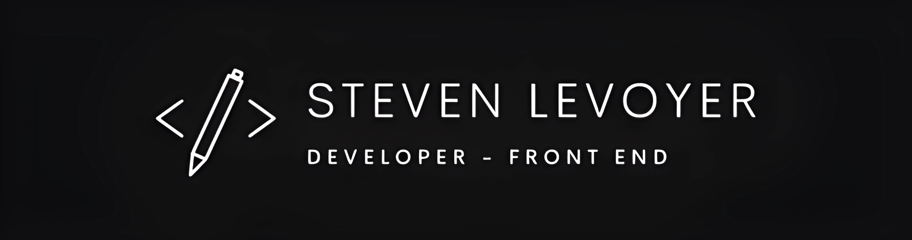

<h6 align="center">Hi there, I am Steven 👋</h6>

  

     
  

  
<b>✨ Innovating with technology. 🚀  Full-Stack Developer. 💡 Building the future today!</b>
 

<h5><b>I'm here to put on a show</b></h5>

👨‍💻 Enthusiastic developer blending design creativity with code precision. Experienced in both Frontend and Backend development with C# and ASP.NET Core.  Actively engaged in the realm of artificial intelligence and constantly exploring cutting-edge technologies. 🚀✨
 

<h2><b>📩Connect</b></h2>

  <ul>
    <li>Do you have any question or project to work together? Don't hesitate! Coffee's on me </li> 
  </ul>
  

    

      
      
      
      
      
      
    

  

<h2><b>💼 Technical Skills</b></h2>

  
 
    
    
  

  

     
    
  

  

    
    
    
    
    
    
    
    
    
    
  

  

    
    
  

  

    
     
    
    
    
    
    
    
  

  

    
    
  

  

    
    
    
  

  

    
    
    
    
    
  

<h2><b>📁 Proyectos Destacados</b></h2>

  <ul>
    <li> 
      <a href="enlace-al-repositorio-karaoke"> Karaoke </a> - Aplicación web para gestionar pedidos y canciones en un bar karaoke, desarrollada con C#, ASP.NET Core y SQL Server.
    </li>
    <li>
       (Aquí puedes agregar más proyectos en el futuro)
    </li>
  </ul>

<h2><b>📈 GitHub Stats</b></h2>

<h2><b>🗂️ Languages</b></h2>

<h2><b>📃 Current Goals</b></h2>

- [ ] Master English:
  - [x] Practice conversation regularly.
  - [x] Read material in English constantly.

- [ ] Learn Python:
  - [x] Complete online courses.
  - [ ] Participate in practical projects.
  - [ ] Learn MongoDB

- [ ] Learn AI Development:
  - [ ] Study machine learning algorithms.
  - [ ] Develop practical AI projects.

- [ ] Find a Job as a Full-Stack Developer with focus on C# and .NET: 
  - [x] Explore job opportunities.
  - [x] Improve resume and LinkedIn profile.
  - [x] Improve Github profile
  - [x] Create portfolio 

- [ ] Master GitHub's Copilot Tool:
  - [x] Familiarize myself with its functions.
  - [x] Use Copilot in real projects.

- [ ] Learn and Master Code Creation Based on Test Creation:
  - [x] Study test creation methodologies.
  - [ ] Apply tests in practical projects.
